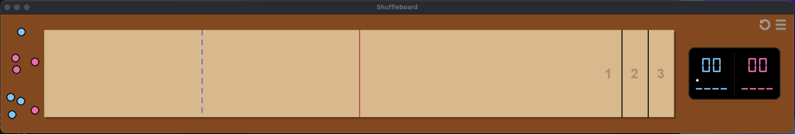

# Shuffleboard

**Shuffleboard** is a physics-based table shuffleboard game built for macOS and Windows. It is currently an open 2-player implementation.

This project is being developed as an environment to train and test ML models to play competitively.

## Download

* [**Download Shuffleboard for MacOS (Google Drive)**](https://drive.google.com/file/d/1vKc4h0UFCQ1bH6R-a3DQM6Tk1YMgJxbc/view?usp=drive_link#)
* [**Download Shuffleboard for Windows (Google Drive)**](https://drive.google.com/file/d/1MBFXPT7wwIOmyzQk7IHpd-XPYTnwQ20O/view?usp=sharing)

---

## Installation Instructions

### macOS
This application is not signed by Apple, so you will need to bypass the security check on first launch.

1. Download the .zip file from the link above and unzip it.
2. Right-click (or Control-click) the Shuffleboard app icon and select Open.
3. A warning dialog will appear. Click Done.
4. Open your System Settings > Privacy & Security, scroll to the bottom, and click Open Anyway.
5. Enter your user password if prompted.

You only need to do this the first time. Afterwards, you can just click on the app to run it.

### Windows
1. Download the Windows .zip file and unzip it.
2. Open the folder and double-click Shuffleboard.exe.
3. If Windows Defender pops up and prevents the app from starting, click More Info, then click Run Anyway.

---

## How to Play

### Controls & Mechanics
1. **Grab:** On your turn, hover your mouse over one of your colored pucks, then click and hold to grab it.
2. **Throw:** Drag the mouse quickly and release the click inside the throwing area to launch the puck.

* You can release a puck in the gutter or throwing area with no momentum to drop it.
* You can use a puck in hand to push and rearrange other pucks in the gutter and throwing area.
* A puck can only enter the foul and scoring areas and interact with pucks there if it has been thrown from the throwing area with momentum on your turn.

### Board Layout
The board is divided into specific areas divided by color and colored lines: 
* **The Gutter:** The dark area surrounding the table. This is where your pucks start before you throw them, and where pucks end if they fall off the table. You can throw pucks in here freely.
* **Throwing Area:** The zone to the left of the **dotted blue line**. Throw a puck from this area to take your turn.
* **Foul Area:** The entire zone to the left of the **solid red line**. At the start of each turn, any puck that has not crossed the red line is returned to the gutter.
* **Scoring Area:** The entire area to the right of the **solid red line**. Pucks must completely cross this line to stay on the table and count towards points for the round.

### Objective
The goal is to slide your pucks into the numbered zones at the opposite end of the table without falling off the end or sides. You can also try to knock your opponent's pucks off the table to prevent them from scoring.

Points are awarded based on where the pucks lie at the end of a round. A puck must completely cross over a line to be in the next zone. Only the player with the furthest puck scores points for the round. They receive points for every puck that is ahead of their opponent's furthest puck. 

* **1 Point:** Closest zone.
* **2 Points:** Middle zone.
* **3 Points:** Furthest zone.
* **4 Points (Optional):** A puck hanging partially off the back edge of the 3 point zone.

The player who scores throws the first puck next round. If nobody scores in a round, the starting puck changes hands. The first player to reach 21 points, or optionally 15 points, wins the game. 

---

## The Scoreboard
The digital scoreboard tracks the game state in real-time.

* Main Score: Large numbers show the total accumulated score for the game.
* Turn Indicator: The white dot indicates whose turn it is to throw.
* Round Score: Small numbers show how many points would be added to your main score if the round ended now. This updates instantly as pucks move.
* Throws Remaining: The dashes at the bottom represent your pucks. Each player gets 4 throws per round.

---

## Game Options & Settings
Click the Puck Icon on the top right corner to replace all non-scoring pucks in the left side gutter.

Click the Replay Icon on the top right corner to start a new game, resetting all pucks and the scoreboard.

Click the Menu Icon on the top right corner to open the Options Screen.

### Table Settings
* Game Size: Increases or decreases the PPI (pixels per inch), zooming the game window in or out.
* Table Length: Adjusts the physical length of the table from 9 feet to 22 feet.
* Puck Size: Toggles between medium (2 1/8") and large (2 5/16").
* Score Goal: Toggles between playing a game to 21 or 15 points.
* Hanging Points: Toggles scoring for pucks hanging off the edge between 4 points and 3 points.

### Player Customization
* The two tables in the center allow you to choose puck colors. 
* The top table is for Player 1 (scoreboard left), and the bottom table is for Player 2 (scoreboard right).
* Tip: Practice throwing pucks on these tables to test the friction!

### Resume vs. Reset
* RESUME: Returns you to the current game without changes.
* RESET: If you change a setting that affects gameplay (table length, puck size, score goal, or hanging points), the button will change to RESET. Clicking this will apply changes and start a new game by resetting the puck positions and scoreboard.

---

## Saving & Memory
The game automatically saves your progress (score, puck positions, current turn) and your settings preferences.

Warning:
If you force quit the app using Command+Q (Mac) or Alt+F4 (Windows), the game may not save the current state. Close the window using the 'X' button to ensure your game is saved.

### Managing Save Data
The save file is located in your computer's application data folder.

**Mac:**
~/Library/Application Support/Shuffleboard/memory.json

**Windows:**
%APPDATA%\Shuffleboard\memory.json

To reset everything to default (delete your save):
1. Navigate to the folder listed above.
2. Delete memory.json.

---

## Feedback & Support

Found a bug or have a suggestion? Send me an email at **sloan@cinkle.com**.

Love the game and wanna buy me a coffee? Find me on Venmo or CashApp at **@sloancinkle**.
