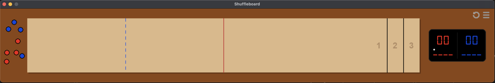
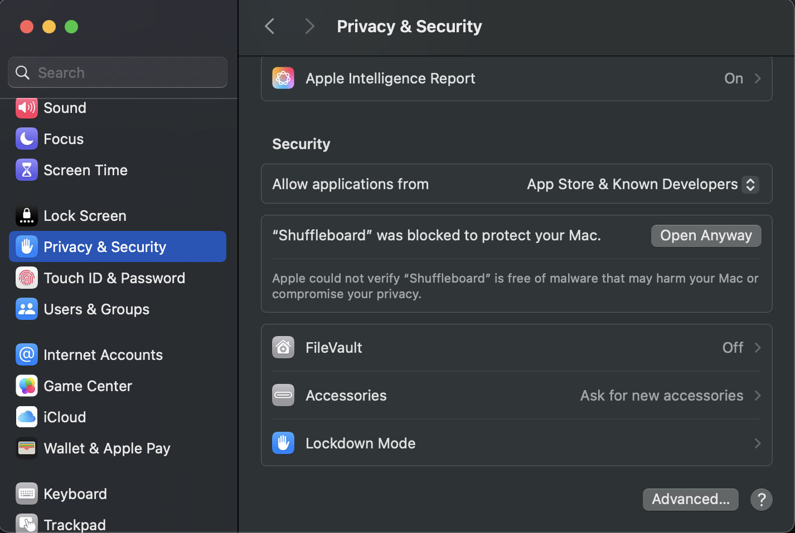
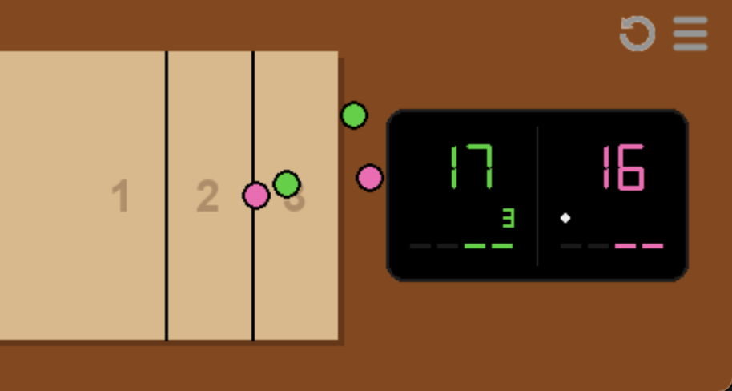
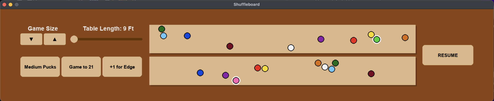

# Shuffleboard

A physics-based 2-player table shuffleboard game built for macOS.

## Download
**Currently available for macOS only.**

[**Download Shuffleboard for Mac (Google Drive)**](https://drive.google.com/file/d/1vKc4h0UFCQ1bH6R-a3DQM6Tk1YMgJxbc/view?usp=drive_link#)

---

## Installation Instructions
Because this application is not signed by Apple, you will need to bypass the security check once upon first launch.

1. Download the .zip file from the link above and unzip it.
2. Right-click (or Control-click) the Shuffleboard app icon and select Open.
3. A warning dialog will appear. Click Close.
4. Open your System Settings > Privacy & Security, scroll to the bottom, and click Open Anyway (see screenshot).
5. Enter your user password if prompted.

Note: You only need to do this the first time. Afterwards, you can just click on the app to run it.

---

## How to Play

### Controls & Mechanics
1. **Grab:** On your turn, hover your mouse over one of your colored pucks in the gutter, then click and hold to grab it.
2. **Throw:** Drag the mouse forward quickly and release the click while inside the throwing area area to launch the puck.

* You can release a puck in the gutter or throwing area with no momentum to drop it. 
* You can use a puck in hand to push and rearrange other pucks in the gutter and throwing area.
* A puck can only enter the foul and scoring areas and interact with pucks on the table if it has been thrown from the throwing area with momentum on your turn.

### Board Layout
The table is divided into specific areas marked by colored lines:
* **The Gutter:** The dark area surrounding the table. This is where your pucks start before you throw them, and where pucks end if they fall off the board.
* **Throwing Area:** The zone to the left of the **dotted blue line**. You must release your throw before your cursor crosses this line.
* **Foul Area:** The zone between the spotted blue line and the **solid red line**. Any thrown puck that stops short of the red line is considered a foul and will be returned to the gutter.
    * *Exception:* On a 9-foot table, there is no foul area; the scoring zone begins immediately after the throw line.
* **Scoring Area:** The entire area to the right of the **solid red line**. Pucks must cross this line to remain on the board and be eligible for points.

### Objective
The goal is to slide your pucks into the numbered zones at the opposite end of the table without falling off the end or sides. You can also try to knock your opponent's pucks off the board to prevent them from scoring.

### Scoring
Points are awarded based on where the puck stops:
* **1 Point:** Closest zone.
* **2 Points:** Middle zone.
* **3 Points:** Furthest zone.
* **4 Points (Optional):** A puck hanging partially off the back edge of the board.

Only the player with the furthest puck scores points for the round. They receive points for every puck that is ahead of their opponent's furthest puck. 

The player who scores throws the first puck next round. If nobody scores in a round, the starting puck changes hands. 

---

## The Scoreboard
The digital scoreboard tracks the game state in real-time.

* Main Score: Large numbers show the total accumulated score for the game.
* Turn Indicator: White dot indicates whose turn it is to throw.
* Round Score: Small numbers show how many points would be added to your main score if the round ended. This updates instantly as pucks move.
* Throws Remaining: Dashes represent your pucks. Each player gets 4 throws per round.

---

## Game Options & Settings
Click the Replay Icon on the top right corner to start a new game, replacing the pucks in the left side gutter and resetting the scoreboard.

Click the Menu Icon on the top right corner to open the Options Screen.

### Table Settings
* Window Size: Increases or decreases the PPI (pixels per inch), zooming the game window in or out to fit your screen.
* Table Length: Adjusts the physical length of the board from 9 feet to 22 feet.
* Puck Size: Cycles between Large (2 5/16 inches) and Medium (2 1/8 inches).
    * Note: The game automatically defaults to Medium for tables less than 15 feet and Large for tables 15 feet and over, but you can override this manually.
* Game Goal: Toggle between playing a game to 15 or 21 points.
* Hangers Rule: Toggle scoring for pucks hanging off the edge between 4 points and 3 points.

### Player Customization
* The two wooden tables in the center allow you to choose puck colors. 
* The top table is for Player 1 (scoreboard left), and the bottom table is for Player 2 (scoreboard right).
* Tip: You can practice throwing pucks on these mini-tables to test the friction!

### Resume vs. Reset
* RESUME: Returns you to the current game without changes.
* RESET: If you change a setting that affects gameplay (Table Length, Puck Size, Rules), the button will change to RESET. Clicking this will apply changes and start a new match.

---

## Saving & Memory
The game automatically saves your progress (score, puck positions, current turn) and your settings preferences.

When does it save?
* When you click the 'X' button to close the window.
* When you press 'Start/Resume' in the menu.

Warning:
If you force quit the app using Command+Q, the game will not save the current state. Close the window using the red 'X' button to ensure your game is saved.

### Managing Save Data
The save file is located securely in your Mac's Application Support folder:
~/Library/Application Support/Shuffleboard/memory.json

To reset everything to default (delete your save):
1. Open Finder.
2. Press Cmd + Shift + G.
3. Paste: ~/Library/Application Support/Shuffleboard/
4. Delete memory.json.