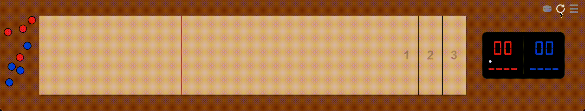
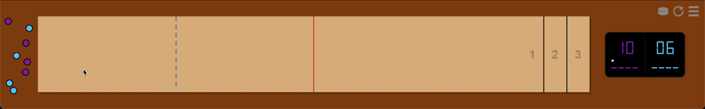
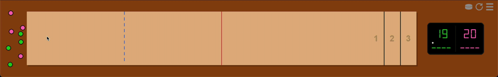
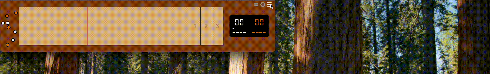

# Shuffleboard

**Shuffleboard** is a simple table shuffleboard game built for macOS and Windows. It is currently an open 2-player implementation.

This project is being developed as an environment to train and test ML models to play competitively.

## Download

* [**Download Shuffleboard for MacOS (Google Drive)**](https://drive.google.com/file/d/1vKc4h0UFCQ1bH6R-a3DQM6Tk1YMgJxbc/view?usp=drive_link)
* [**Download Shuffleboard for Windows (Google Drive)**](https://drive.google.com/file/d/1MBFXPT7wwIOmyzQk7IHpd-XPYTnwQ20O/view?usp=drive_link)

---

## Installation

### macOS
*Note: This application is not signed by Apple, so you must bypass the security check on first launch.*

1. Download the macOS `.zip` file from the link above.
2. Unzip the file, then delete the `.zip` archive.
3. **Right-click (or Control-click)** `Shuffleboard.app` and select **Open**.
4. A warning dialog will appear. Click **Done**.
5. Open **System Settings** > **Privacy & Security**, scroll to the bottom, and click **Open Anyway**.
6. Enter your user password when prompted.

You only need to do this once. Afterwards, you can simply click the app to run it.

### Windows
1. Download the Windows `.zip` file from the link above.
2. Open the file and copy `Shuffleboard.exe` to a new location. Delete the `.zip` file.
3. Double-click `Shuffleboard.exe` to launch.
4. If Windows Defender prevents the app from starting, click **More Info**, then **Run Anyway**.

---

## How to Play

### Objective
The goal is to slide your pucks into the numbered zones at the opposite end of the table without falling off the end or sides. You can also knock your opponent's pucks off the table to prevent them from scoring.

The first player to reach **21 points** (or optionally 15) wins the game.

### Controls
1. **Grab:** Hover your mouse over one of your colored pucks, then click and hold to grab it.
2. **Throw:** Drag the mouse quickly and release the click to launch the puck.
3. **Drop:** Release a puck with no momentum to drop it.

### Scoring Rules
Points are awarded based on where the pucks lie at the end of a round. A puck must **completely cross** a line to count for the next zone.

* **1 Point:** Closest and largest zone (5 feet long).
* **2 Points:** Middle zone (6 inches long).
* **3 Points:** Furthest zone (6 inches long).
* **4 Points (Optional):** A puck hanging partially off the back edge of the 3-point zone.

**Scoring Mechanics:**
* Only the player with the **furthest puck** scores points for the round.
* They receive points for every puck that is ahead of their opponent's furthest puck.
* If two opposing pucks are tied for distance, neither scores.
* The player who scores throws the first puck in the next round. If nobody scores, the starting puck changes hands.

### Board Layout
The board is separated into specific zones by color and lines.

* **The Gutter:** The dark area surrounding the table. You can move and throw pucks here freely.
* **Throwing Area:** The 3-foot zone to the left of the **dotted blue line**. You must throw from inside this area to take your turn.
* **Foul Area:** The entire area to the left of the **solid red line** (includes the throwing area). Any puck not crossing this red line is removed.
    * *Note: On a 9-foot table, the throwing area and foul area share a solid red line.*
* **Scoring Area:** The 6-foot area to the right of the **solid red line**. Pucks must cross into this area to count.

---

## The Scoreboard
The digital scoreboard tracks game state in real-time.

* **Main Score:** Large numbers showing total accumulated score.
* **Turn Indicator:** The white dot indicates whose turn it is.
* **Round Score:** Small numbers showing the score for the *current* round (updates instantly).
* **Throws Remaining:** Dashes at the bottom represent your pucks (4 throws per round).

---

## Game Options

Click the icons in the top right corner to manage your game:
* **Puck Icon:** Moves all non-scoring pucks back to the left side gutter.
* **Replay Icon:** Starts a new game, resetting all pucks and the scoreboard.
* **Menu Icon:** Opens the options screen (detailed below).

### Options
* **Table Length:** Adjusts table length from 9 feet (default) to 22 feet.
* **Puck Size:** Toggles between medium pucks (2 1/8") and large pucks (2 5/16").
   * *Defaults to medium for tables under 15 feet, and large for tables over 14 feet.
* **Score Goal:** Toggles winning score between 21 and 15 points.
* **Edge Points:** Toggles scoring for pucks hanging off the back edge between 4 points and 3 points.
* **Resume vs. Reset:**
   * **RESUME:** Returns to the current game.
   * **RESET:** If you changed a setting that affects gameplay, this button appears to start a fresh game.

### Player Colors
Use the color tables in the center to choose puck colors. The top table controls scoreboard left, and the bottom table controls scoreboard right. 

---

## Saving & Memory
The game automatically saves your progress and preferences.

**Warning:** If you force quit the app using `Command+Q` (Mac) or `Alt+F4` (Windows), the game may not save the current state. **Always close the window using the 'X' button to ensure your game is saved.**

### Managing Save Data
The save file (`memory.json`) is located in your computer's application data folder.

* **Mac:** `~/Library/Application Support/Shuffleboard/memory.json`
* **Windows:** `%APPDATA%\Shuffleboard\memory.json`

To reset everything to default, navigate to the folder above and delete `memory.json`.

---

## Feedback & Support

Found a bug or have a suggestion? Send me an email at **sloan@cinkle.com**.

Love the game and want to buy me a coffee? Find me on Venmo or CashApp at **@sloancinkle**.
